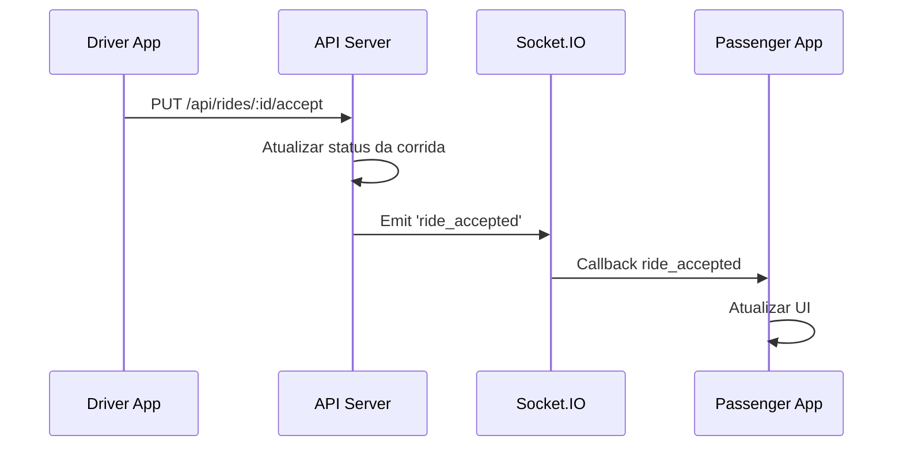
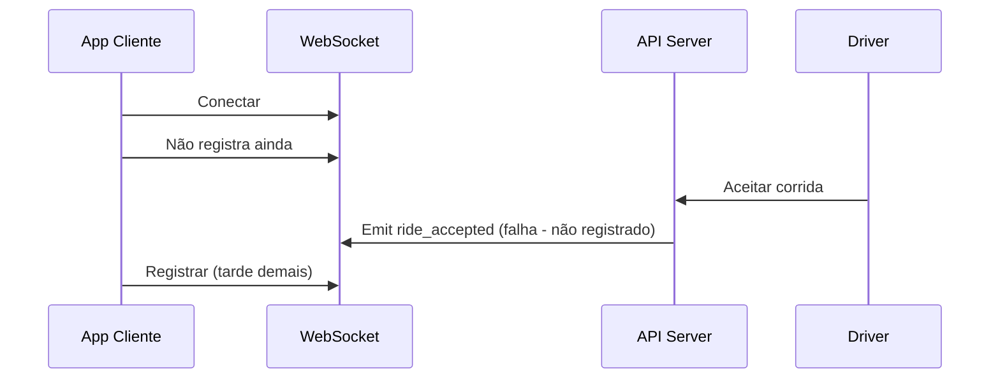
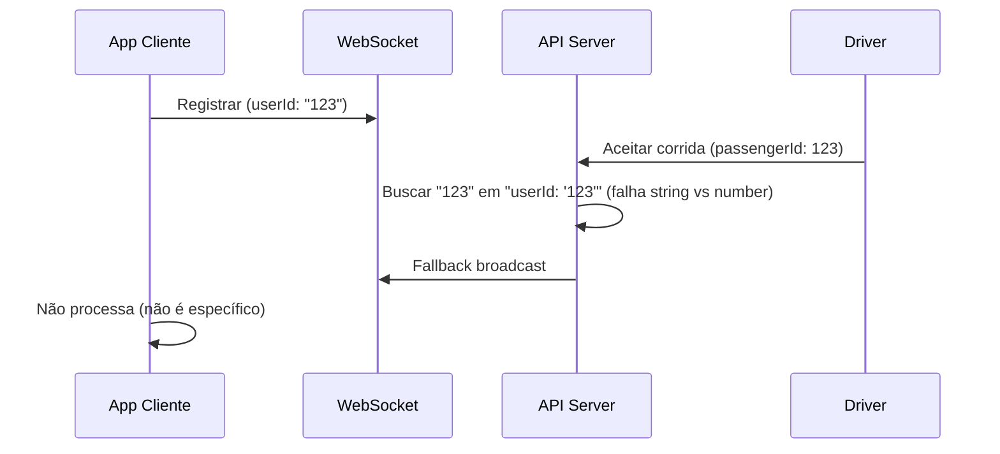
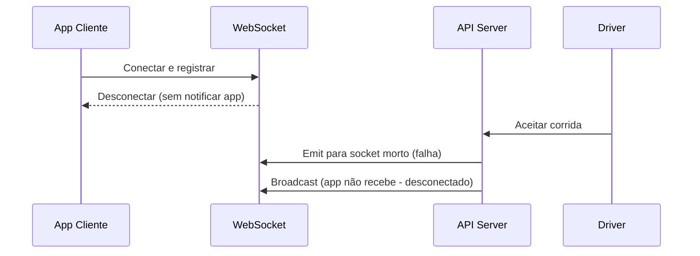

# Análise de Falha de Callbacks - Aceitação de Corrida

## Visão Geral

A API está estruturada corretamente para o fluxo de aceitação de corridas, mas os callbacks WebSocket não estão chegando ao cliente passageiro quando o motorista aceita uma corrida. Esta análise identifica os pontos de falha potenciais no sistema de callbacks.

## Arquitetura Atual

### Fluxo de Aceitação de Corrida



### Sistema de Notificação WebSocket

A API utiliza um sistema dual de notificação:
1. **Específico**: Busca o passageiro nas conexões ativas pelo socket ID
2. **Broadcast**: Envia para todos os passageiros se específico falhar

## Pontos de Falha Identificados

### 1. Problema de Registro de Conexão

**Localização**: `api/server.js` linha 50-65

```javascript
socket.on('register', (data) => {
  const { userType, userId } = data;
  activeConnections.set(socket.id, { userType, userId, socketId: socket.id });
  socket.join(userType);
});
```

**Problemas Potenciais**:
- O registro do socket pode não estar sendo executado corretamente
- O `userId` do passageiro pode não estar coincidindo com o `passengerId` da corrida
- A conexão pode estar sendo perdida entre o registro e a aceitação

### 2. Falha na Busca de Conexão Específica

**Localização**: `api/routes/rides.js` linha 324-377

```javascript
// Tentar encontrar o passageiro específico
for (const [socketId, connection] of activeConnections.entries()) {
  if (connection.userType === 'passenger' && connection.userId === ride.passengerId) {
    // Enviar para socket específico
    io.to(socketId).emit('ride_accepted', notificationData);
    passengerNotified = true;
    break;
  }
}
```

**Problemas Potenciais**:
- `connection.userId` pode estar em formato diferente de `ride.passengerId`
- Socket pode estar desconectado mas ainda na lista de conexões ativas
- Comparação de strings/números pode estar falhando

### 3. Configuração Tardia de Callbacks no Cliente

**Localização**: `screens/HomeScreen.js` linha 317-640

O cliente está configurando callbacks APÓS a inicialização, mas pode haver uma condição de corrida onde:
- A corrida é aceita antes dos callbacks serem registrados
- O evento é enviado mas não há listener configurado

### 4. Problema de URL de Configuração

**Localização**: `config/api.js`

A configuração está usando URLs de produção:
```javascript
API_BASE_URL: 'https://three-api-9fac.onrender.com/api'
SOCKET_URL: 'https://three-api-9fac.onrender.com'
```

Mas a memória indica que deve usar localhost durante desenvolvimento.

## Cenários de Falha

### Cenário 1: Dessincronia de Registro


### Cenário 2: Incompatibilidade de IDs


### Cenário 3: Socket Desconectado Silenciosamente


## Diagnóstico Recomendado

### 1. Verificação de Logs do Servidor

Analisar os logs da API durante aceitação de corrida:
- Verificar se o evento `ride_accepted` está sendo emitido
- Confirmar se o passageiro foi encontrado nas conexões ativas
- Validar se o broadcast fallback está sendo executado

### 2. Verificação de Estado do Cliente

No `HomeScreen.js`, adicionar logs para verificar:
- Se os callbacks estão registrados antes da aceitação
- Se o socket está conectado durante a aceitação
- Se o `userId` registrado coincide com o `passengerId` da corrida

### 3. Teste de Conectividade WebSocket

Implementar teste manual para verificar:
- Conectividade do socket
- Recepção de eventos de teste
- Estado da conexão durante o fluxo completo

## Soluções Propostas

### 1. Correção de Registro Imediato

Garantir que o registro do socket aconteça imediatamente após a conexão:

```javascript
// No apiService.js
this.socket.on('connect', () => {
  // Registrar IMEDIATAMENTE após conectar
  this.socket.emit('register', {
    userType: this.userType,
    userId: this.userId
  });
});
```

### 2. Normalização de IDs

Garantir que IDs sejam consistentemente strings:

```javascript
// No servidor, na busca de conexões
if (connection.userType === 'passenger' && 
    String(connection.userId) === String(ride.passengerId)) {
  // ...
}
```

### 3. Validação de Socket Ativo

Verificar se o socket está realmente conectado antes de enviar:

```javascript
// No servidor
const socket = io.sockets.sockets.get(socketId);
if (socket && socket.connected) {
  io.to(socketId).emit('ride_accepted', notificationData);
  passengerNotified = true;
} else {
  // Remover conexão inválida
  activeConnections.delete(socketId);
}
```

### 4. Configuração de URL para Desenvolvimento

Usar configuração local durante desenvolvimento:

```javascript
API_BASE_URL: 'http://localhost:3000/api'
SOCKET_URL: 'http://localhost:3000'
```

### 5. Heartbeat e Reconexão Automática

Implementar sistema de heartbeat para detectar desconexões:

```javascript
// Ping periódico para manter conexão ativa
setInterval(() => {
  if (this.socket && this.socket.connected) {
    this.socket.emit('ping');
  }
}, 30000);
```

## Plano de Testes

### Teste 1: Verificação de Registro
- Conectar app passageiro
- Verificar se aparece nos logs do servidor
- Confirmar ID registrado

### Teste 2: Teste de Callback Manual
- Usar função de teste no HomeScreen para simular `ride_accepted`
- Verificar se callback é executado

### Teste 3: Teste de Aceitação Real
- Criar corrida como passageiro
- Aceitar via API diretamente
- Verificar logs de ambos os lados

### Teste 4: Teste de Reconexão
- Forçar desconexão do socket
- Verificar se reconecta automaticamente
- Testar aceitação após reconexão

## Monitoramento

### Métricas para Implementar

1. **Taxa de Entrega de Callbacks**: Quantos `ride_accepted` chegam vs enviados
2. **Tempo de Latência**: Tempo entre aceitação e callback
3. **Taxa de Reconexão**: Frequência de desconexões/reconexões
4. **Logs Estruturados**: Incluir IDs únicos para rastreamento

### Alertas Críticos

- Falha na entrega de callback por mais de 10 segundos
- Taxa de reconexão superior a 20%
- Ausência de callbacks por mais de 5 corridas consecutivas

## Conclusão

O problema de callbacks não chegarem ao passageiro tem múltiplas causas potenciais relacionadas principalmente à sincronização entre registro de socket, compatibilidade de IDs e estado de conexão. A implementação de logging detalhado e testes estruturados permitirá identificar a causa raiz específica e aplicar a correção adequada.