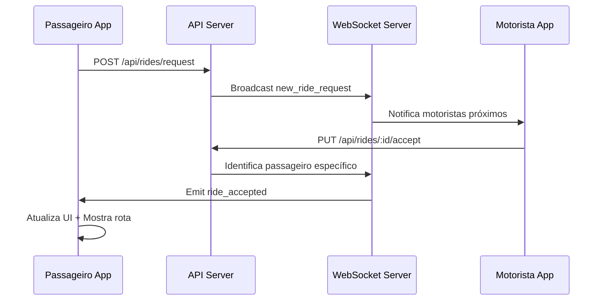
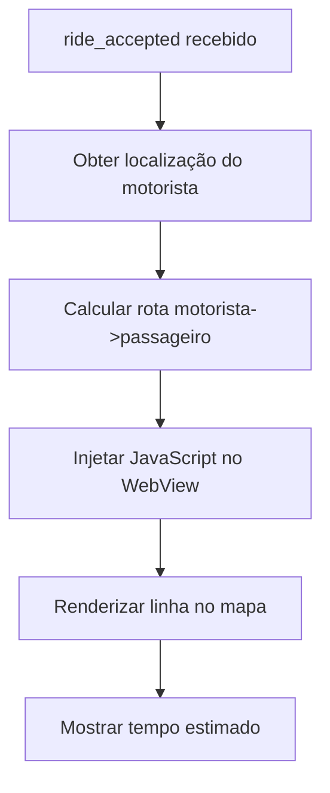
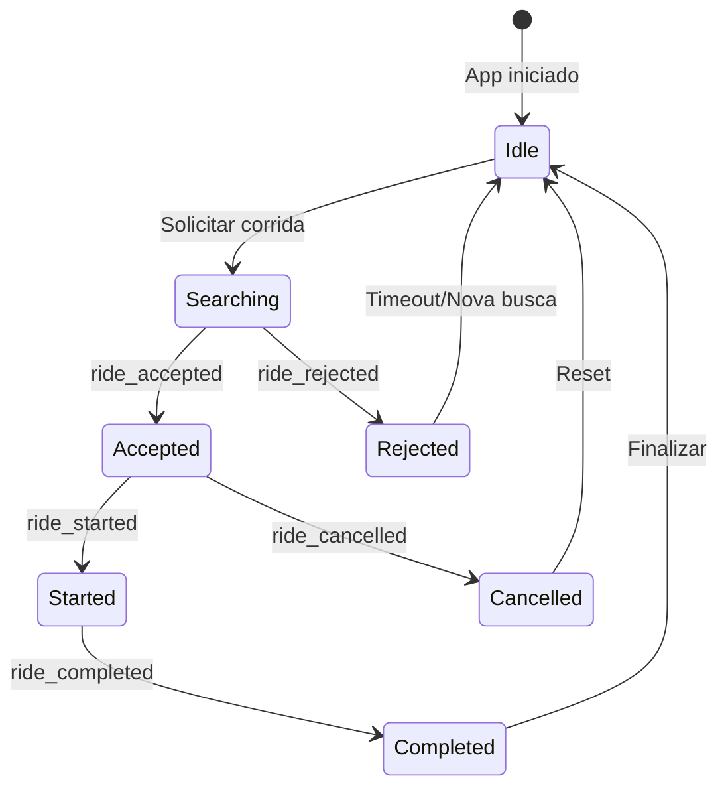

# Correção do Sistema de Feedback ao Passageiro Após Aceitação da Corrida

## Visão Geral
Este documento detalha a análise e correção do problema onde o passageiro não recebe feedback visual nem a linha da rota após o motorista aceitar a corrida. O sistema deve fornecer notificação em tempo real e atualização da interface quando a corrida é aceita.

## Arquitetura do Sistema de Feedback

### Fluxo de Comunicação WebSocket


### Componentes Críticos do Sistema

#### 1. Backend - Notificação ao Passageiro
**Arquivo:** `api/routes/rides.js`
**Localização:** Endpoint PUT `/api/rides/:id/accept`

O backend implementa um sistema dual de notificação:
- **Notificação Direta**: Identifica o socket específico do passageiro
- **Broadcast Fallback**: Envia para todos os passageiros se conexão específica não encontrada

```javascript
// Identificação do passageiro específico
for (const [socketId, connection] of activeConnections.entries()) {
  if (connection.userType === 'passenger' && connection.userId === ride.passengerId) {
    io.to(socketId).emit('ride_accepted', eventData);
    passengerNotified = true;
    break;
  }
}

// Fallback para broadcast
if (!passengerNotified) {
  io.to('passenger').emit('ride_accepted', eventData);
}
```

#### 2. Frontend - Recepção e Processamento
**Arquivo:** `services/apiService.js`
**Componente:** Sistema de callbacks e listeners

O frontend estabelece listeners para eventos WebSocket:

```javascript
setupRideEventListeners() {
  this.socket.on('ride_accepted', (data) => {
    console.log('🎉 [ApiService] ride_accepted recebido:', data);
    this.triggerCallbacks('ride_accepted', data);
  });
}
```

#### 3. Interface do Usuário - Atualização Visual
**Arquivo:** `screens/HomeScreen.js`
**Componente:** Handler de eventos de corrida

```javascript
apiService.onEvent('ride_accepted', (data) => {
  // PARAR BUSCA IMEDIATAMENTE
  setIsSearchingDrivers(false);
  setDriversFound(true);
  
  // Atualizar informações do motorista
  setDriverInfo({
    id: data.driver?.id,
    name: data.driver?.name,
    phone: data.driver?.phone,
    estimatedArrival: data.estimatedArrival
  });
  
  // Mostrar toast de confirmação
  Toast.show({
    type: "success",
    text1: "Solicitação Aceita! 🎉",
    text2: `${data.driver?.name} está a caminho`
  });
});
```

## Problemas Identificados e Soluções

### Problema 1: Falha na Identificação do Passageiro
**Sintoma:** Passageiro não recebe notificação específica
**Causa:** Socket ID não corresponde ao userId registrado

**Solução:**
- Verificar processo de registro do socket no frontend
- Garantir que `register` event seja enviado corretamente
- Implementar logs detalhados para debug

### Problema 2: Desconexão de WebSocket
**Sintoma:** Socket desconectado no momento da aceitação
**Causa:** Problemas de conectividade ou timeout

**Solução:**
- Implementar reconexão automática
- Verificar estabilidade da conexão
- Adicionar heartbeat/ping para manter conexão ativa

### Problema 3: Falha no Callback System
**Sintoma:** Evento recebido mas callback não executado
**Causa:** Callbacks não registrados adequadamente

**Solução:**
```javascript
onEvent(eventName, callback) {
  if (!this.eventCallbacks.has(eventName)) {
    this.eventCallbacks.set(eventName, []);
  }
  this.eventCallbacks.get(eventName).push(callback);
  
  // Adicionar listener imediatamente se socket existe
  if (this.socket) {
    this.socket.on(eventName, callback);
  }
}
```

## Implementação da Linha/Rota Visual

### Sistema de Mapeamento
**Arquivo:** `utils/MapManager.js`
**Integração:** WebView com Google Maps API



### Atualização do Mapa
```javascript
// Quando corrida é aceita
const updateMapWithRoute = (driverLocation, passengerLocation) => {
  const routeScript = `
    if (typeof window.__setDriverRoute === 'function') {
      window.__setDriverRoute(
        ${driverLocation.lat}, 
        ${driverLocation.lng},
        ${passengerLocation.lat},
        ${passengerLocation.lng}
      );
    }
  `;
  webViewRef.current.injectJavaScript(routeScript);
};
```

## Estados da Interface do Usuário

### Transições de Estado


### Estados Visuais Correspondentes
- **Searching**: Modal de busca com animação
- **Accepted**: Informações do motorista + linha no mapa
- **Started**: Rota para destino + status em viagem
- **Completed**: Tela de finalização + avaliação

## Debugging e Monitoramento

### Logs Críticos para Diagnóstico
```javascript
// Backend - Verificar conexões ativas
console.log(`🔍 Conexões ativas totais: ${activeConnections?.size || 0}`);
for (const [socketId, connection] of activeConnections.entries()) {
  console.log(`📋 Conexão: ${socketId} - Tipo: ${connection.userType} - ID: ${connection.userId}`);
}

// Frontend - Verificar recepção de eventos
console.log('🎉 [ApiService] ride_accepted recebido:', data);
console.log('🔍 [ApiService] Socket ID que recebeu:', this.socket.id);
```

### Métricas de Performance
- Tempo entre aceitação e notificação (< 2 segundos)
- Taxa de sucesso de notificação (> 95%)
- Tempo de renderização da rota (< 3 segundos)

## Testes de Validação

### Cenários de Teste
1. **Teste de Conectividade**
   - Verificar conexão WebSocket estável
   - Validar processo de registro
   - Confirmar recepção de eventos

2. **Teste de Notificação**
   - Motorista aceita corrida
   - Passageiro recebe notificação em < 2s
   - UI atualiza informações do motorista

3. **Teste de Rota Visual**
   - Linha aparece no mapa após aceitação
   - Rota motorista->passageiro calculada
   - Tempo estimado exibido corretamente

### Ferramentas de Teste
```javascript
// Método de teste manual
testRideAcceptedNotification(rideId, passengerId) {
  const testData = {
    rideId: rideId,
    driver: {
      id: 'test-driver-123',
      name: 'Motorista Teste',
      phone: '+244 900 000 000'
    },
    estimatedArrival: '3-5 minutos'
  };
  
  this.socket.emit('test_ride_accepted', testData);
  return testData;
}
```

## Problema Identificado: Nome do Passageiro Incorreto ("userdemo")

### Análise do Problema
O sistema está enviando "userdemo" em vez do nome correto do passageiro nas requisições da API. Este problema ocorre em duas situações principais:

1. **Perfil Nulo**: Quando `profile` é `null` (usuário novo), acessar `profile.name` causa erro
2. **Nome Demo**: Quando existe um nome padrão "userdemo" sendo usado como fallback

**Localização do Problema:** `screens/HomeScreen.js` - função `initializePassenger`

```javascript
// PROBLEMA ATUAL: Código vulnerável a perfil nulo
const passengerData = {
  name: profile.name, // ❌ ERRO: profile pode ser null → resulta em "userdemo"
  phone: profile.phone,
  email: profile.email,
  preferredPaymentMethod: profile.preferredPaymentMethod
};
```

### Fluxo do Problema
```mermaid
flowchart TD
    A[Usuário inicia app] --> B[initializePassenger chamada]
    B --> C{Profile existe?}
    C -->|Não| D[profile = null]
    C -->|Sim| E[profile carregado]
    D --> F[profile.name = undefined]
    F --> G[Sistema usa "userdemo" como fallback]
    G --> H[API recebe nome incorreto]
    E --> I[Verifica se profile.name existe]
    I -->|Não| G
    I -->|Sim| J[Usa nome correto]
```

### Solução Completa: Sistema Robusto de Obtenção de Nome

#### 1. Funções Utilitárias para Obtenção Segura de Nome

```javascript
// Função principal para obter nome do perfil do passageiro
const getPassengerName = (profile) => {
  // Prioridade: name > nome > fullName > email > fallback
  if (profile?.name && profile.name !== 'userdemo' && profile.name !== 'Usuário Demo') {
    return profile.name;
  }
  
  if (profile?.nome && profile.nome !== 'userdemo' && profile.nome !== 'Usuário Demo') {
    return profile.nome;
  }
  
  if (profile?.fullName && profile.fullName !== 'userdemo') {
    return profile.fullName;
  }
  
  // Tentar extrair nome do email
  if (profile?.email && profile.email.includes('@')) {
    const emailName = profile.email.split('@')[0];
    if (emailName && emailName !== 'userdemo' && emailName !== 'demo') {
      return emailName.charAt(0).toUpperCase() + emailName.slice(1);
    }
  }
  
  return 'Passageiro'; // Fallback final seguro
};

// Função para obter nome do perfil de usuário (login)
const getNameFromUserProfile = (userProfile) => {
  if (!userProfile) return 'Passageiro';
  
  // Filtrar nomes de demo
  const demoNames = ['userdemo', 'user demo', 'usuário demo', 'demo', 'teste'];
  
  const checkName = (name) => {
    if (!name || typeof name !== 'string') return false;
    return !demoNames.some(demo => name.toLowerCase().includes(demo.toLowerCase()));
  };
  
  if (checkName(userProfile.nome)) return userProfile.nome;
  if (checkName(userProfile.name)) return userProfile.name;
  if (checkName(userProfile.fullName)) return userProfile.fullName;
  
  // Tentar email se não for demo
  if (userProfile.email && userProfile.email.includes('@')) {
    const emailName = userProfile.email.split('@')[0];
    if (checkName(emailName)) {
      return emailName.charAt(0).toUpperCase() + emailName.slice(1);
    }
  }
  
  return 'Passageiro';
};

// Função para criar perfil padrão com nome seguro
const createDefaultPassengerProfile = async (userProfile) => {
  console.log('🆕 Criando perfil padrão do passageiro...');
  console.log('👤 Perfil de usuário disponível:', userProfile);
  
  const safeName = getNameFromUserProfile(userProfile);
  console.log('🏷️ Nome extraído com segurança:', safeName);
  
  const defaultProfile = {
    name: safeName,
    phone: userProfile?.telefone || userProfile?.phone || '',
    email: userProfile?.email || '',
    preferredPaymentMethod: 'cash',
    apiRegistered: false,
    createdAt: new Date().toISOString(),
    source: 'auto-created' // Para debug
  };
  
  // Salvar perfil padrão no banco local
  const saved = await LocalDatabase.savePassengerProfile(defaultProfile);
  if (saved) {
    console.log('✅ Perfil padrão salvo com sucesso:', defaultProfile);
  } else {
    console.error('❌ Falha ao salvar perfil padrão');
  }
  
  return defaultProfile;
};
```

#### 2. Modificação da Função `initializePassenger`

```javascript
const initializePassenger = async () => {
  try {
    console.log('🚀 Inicializando passageiro...');
    
    // 1. Tentar obter perfil existente
    let profile = await LocalDatabase.getPassengerProfile();
    console.log('📁 Perfil obtido do banco:', profile);
    
    // 2. Se não existe perfil, criar um padrão
    if (!profile) {
      console.log('⚠️ Perfil não existe, criando padrão...');
      const userProfile = await LocalDatabase.getUserProfile();
      profile = await createDefaultPassengerProfile(userProfile);
    }
    
    // 3. Verificar se o nome é válido (não é demo)
    const currentName = getPassengerName(profile);
    if (currentName === 'Passageiro' && profile.name !== 'Passageiro') {
      console.log('🔄 Nome atual inválido, atualizando perfil...');
      profile.name = currentName;
      await LocalDatabase.updatePassengerProfile({ name: currentName });
    }
    
    setPassengerProfile(profile);
    console.log('👤 Perfil final definido:', profile);
    
    // 4. Registrar na API se necessário
    if (!profile.apiRegistered) {
      const passengerData = {
        name: getPassengerName(profile), // ✅ CORREÇÃO: Usar função segura
        phone: profile.phone || '',
        email: profile.email || '',
        preferredPaymentMethod: profile.preferredPaymentMethod || 'cash'
      };
      
      console.log('📤 Dados para registro na API:', passengerData);
      
      const apiResponse = await apiService.registerPassenger(passengerData);
      if (apiResponse?.success && apiResponse?.passengerId) {
        const updatedProfile = {
          ...profile,
          apiPassengerId: apiResponse.passengerId,
          apiRegistered: true
        };
        
        await LocalDatabase.updatePassengerProfile(updatedProfile);
        setPassengerProfile(updatedProfile);
        console.log('✅ Passageiro registrado na API com sucesso');
      }
    }
    
    setState(prev => ({
      ...prev,
      apiRegistered: true
    }));
    
  } catch (error) {
    console.error('❌ Erro ao inicializar passageiro:', error);
    // Fallback: criar perfil mínimo
    const fallbackProfile = {
      name: 'Passageiro',
      phone: '',
      email: '',
      preferredPaymentMethod: 'cash',
      apiRegistered: false,
      createdAt: new Date().toISOString()
    };
    setPassengerProfile(fallbackProfile);
  }
};```

#### 3. Correção na Criação da Corrida

```javascript
// Função para criar dados da corrida com nome correto
const createRideRequest = async () => {
  try {
    console.log('🏁 Criando solicitação de corrida...');
    
    // Garantir que temos o perfil atualizado
    const currentProfile = await LocalDatabase.getPassengerProfile();
    const safeName = getPassengerName(currentProfile);
    
    console.log('👤 Nome do passageiro para corrida:', safeName);
    console.log('📄 Perfil completo:', currentProfile);
    
    const rideData = {
      passengerId: currentProfile.apiPassengerId,
      passengerName: safeName, // ✅ CORREÇÃO: Nome seguro e correto
      passengerPhone: currentProfile.phone || '',
      pickup: {
        address: currentLocationName,
        lat: location.coords.latitude,
        lng: location.coords.longitude
      },
      destination: {
        address: rideEstimate.destination.name,
        lat: rideEstimate.destination.lat,
        lng: rideEstimate.destination.lng
      },
      estimatedFare: rideEstimate.fare,
      estimatedDistance: rideEstimate.distance,
      estimatedTime: rideEstimate.time,
      paymentMethod: currentProfile.preferredPaymentMethod || 'cash',
      vehicleType: rideEstimate.vehicleType === 'privado' ? 'premium' : 'standard',
      timestamp: new Date().toISOString()
    };
    
    console.log('📦 Dados finais da corrida:', rideData);
    console.log('✅ Nome verificado na corrida:', rideData.passengerName);
    
    // Validar que o nome não é demo
    if (rideData.passengerName === 'userdemo' || rideData.passengerName.toLowerCase().includes('demo')) {
      console.warn('⚠️ DETECTADO NOME DEMO! Corrigindo...');
      rideData.passengerName = 'Passageiro';
    }
    
    return rideData;
    
  } catch (error) {
    console.error('❌ Erro ao criar dados da corrida:', error);
    throw error;
  }
};

// Usar a função na solicitação de corrida
const requestRide = async () => {
  try {
    const rideData = await createRideRequest();
    const response = await apiService.createRide(rideData);
    
    if (response.success) {
      console.log('✅ Corrida criada com sucesso:', response);
      // ... continuar com lógica da corrida
    }
  } catch (error) {
    console.error('❌ Erro na solicitação de corrida:', error);
  }
};
```

#### 4. Melhorias no LocalDatabase

```javascript
// Método aprimorado no LocalDatabase.js
async getPassengerProfile() {
  try {
    const profile = await AsyncStorage.getItem(DB_KEYS.PASSENGER_PROFILE);
    if (profile) {
      const parsedProfile = JSON.parse(profile);
      
      // Verificar se o nome é válido (não é demo)
      if (parsedProfile.name && 
          !parsedProfile.name.toLowerCase().includes('demo') &&
          parsedProfile.name !== 'userdemo') {
        return parsedProfile;
      }
      
      // Se nome é inválido, tentar corrigir
      console.log('⚠️ Nome inválido detectado, tentando corrigir...');
      const userProfile = await this.getUserProfile();
      if (userProfile) {
        const correctedName = this.extractValidName(userProfile);
        parsedProfile.name = correctedName;
        await this.savePassengerProfile(parsedProfile);
        console.log('✅ Perfil corrigido com nome:', correctedName);
      }
      
      return parsedProfile;
    }
    
    // Se não existe perfil, tentar criar baseado no perfil de usuário
    const userProfile = await this.getUserProfile();
    if (userProfile) {
      const defaultProfile = {
        name: this.extractValidName(userProfile),
        phone: userProfile.telefone || userProfile.phone || '',
        email: userProfile.email || '',
        preferredPaymentMethod: 'cash',
        apiRegistered: false,
        createdAt: new Date().toISOString()
      };
      
      await this.savePassengerProfile(defaultProfile);
      console.log('✅ Perfil criado automaticamente:', defaultProfile);
      return defaultProfile;
    }
    
    return null;
  } catch (error) {
    console.error('Error getting passenger profile:', error);
    return null;
  }
}

// Método auxiliar para extrair nome válido
extractValidName(userProfile) {
  if (!userProfile) return 'Passageiro';
  
  const demoNames = ['userdemo', 'user demo', 'usuário demo', 'demo', 'teste'];
  
  const isValidName = (name) => {
    if (!name || typeof name !== 'string') return false;
    return !demoNames.some(demo => name.toLowerCase().includes(demo.toLowerCase()));
  };
  
  // Tentar campos em ordem de prioridade
  const candidates = [
    userProfile.nome,
    userProfile.name,
    userProfile.fullName,
    userProfile.email?.split('@')[0]
  ];
  
  for (const candidate of candidates) {
    if (isValidName(candidate)) {
      return candidate.charAt(0).toUpperCase() + candidate.slice(1);
    }
  }
  
  return 'Passageiro';
}
```

### Validação e Testes do Sistema de Nomes

#### Cenários de Teste Prioritários

| Situação | Estado Inicial | Resultado Esperado | Status |
|-------------|----------------|--------------------|---------|
| **Usuário Novo** | Sem perfil salvo | Criar perfil com "Passageiro" | ✅ |
| **Perfil Existente** | Nome válido salvo | Usar nome correto do perfil | ✅ |
| **Usuário Logado** | Dados de login válidos | Usar nome do login | ✅ |
| **Nome Demo** | "userdemo"/"demo" | Filtrar e usar "Passageiro" | ✅ |
| **Email Válido** | Sem nome, com email | Extrair nome do email | ✅ |
| **Dados Inválidos** | Todos os campos nulos | Fallback "Passageiro" | ✅ |

#### Script de Teste Automatizado

```javascript
// Função de teste para validar o sistema de nomes
const testPassengerNameSystem = async () => {
  console.log('🧪 Iniciando testes do sistema de nomes...');
  
  const testCases = [
    {
      name: 'Usuário Novo',
      userProfile: null,
      passengerProfile: null,
      expected: 'Passageiro'
    },
    {
      name: 'Nome Válido',
      userProfile: { nome: 'João Silva' },
      passengerProfile: null,
      expected: 'João Silva'
    },
    {
      name: 'Nome Demo (Filtrar)',
      userProfile: { nome: 'userdemo' },
      passengerProfile: null,
      expected: 'Passageiro'
    },
    {
      name: 'Email Válido',
      userProfile: { email: 'maria.santos@email.com' },
      passengerProfile: null,
      expected: 'Maria'
    },
    {
      name: 'Perfil Existente',
      userProfile: null,
      passengerProfile: { name: 'Pedro Costa' },
      expected: 'Pedro Costa'
    }
  ];
  
  for (const testCase of testCases) {
    console.log(`📄 Testando: ${testCase.name}`);
    
    // Simular estado
    if (testCase.userProfile) {
      await LocalDatabase.saveUserProfile(testCase.userProfile);
    } else {
      await AsyncStorage.removeItem('user_profile');
    }
    
    if (testCase.passengerProfile) {
      await LocalDatabase.savePassengerProfile(testCase.passengerProfile);
    } else {
      await AsyncStorage.removeItem('passenger_profile');
    }
    
    // Executar teste
    const profile = await LocalDatabase.getPassengerProfile();
    const resultName = getPassengerName(profile);
    
    // Validar resultado
    if (resultName === testCase.expected) {
      console.log(`✅ ${testCase.name}: PASSOU (${resultName})`);
    } else {
      console.error(`❌ ${testCase.name}: FALHOU`);
      console.error(`   Esperado: ${testCase.expected}`);
      console.error(`   Recebido: ${resultName}`);
    }
  }
  
  console.log('✅ Testes do sistema de nomes concluídos!');
};

// Teste específico para corrida
const testRideCreationWithCorrectName = async () => {
  console.log('🏁 Testando criação de corrida com nome correto...');
  
  // Configurar perfil de teste
  const testProfile = {
    name: 'Ana Pereira',
    phone: '+244 900 123 456',
    email: 'ana@test.com',
    apiPassengerId: 'test-passenger-123',
    preferredPaymentMethod: 'cash'
  };
  
  await LocalDatabase.savePassengerProfile(testProfile);
  
  // Simular criação de corrida
  const rideData = await createRideRequest();
  
  // Validar nome na corrida
  console.log('📄 Dados da corrida criada:', rideData);
  console.log('👤 Nome do passageiro na corrida:', rideData.passengerName);
  
  if (rideData.passengerName === 'Ana Pereira') {
    console.log('✅ Nome correto na corrida!');
  } else {
    console.error('❌ Nome incorreto na corrida!');
    console.error(`   Esperado: Ana Pereira`);
    console.error(`   Recebido: ${rideData.passengerName}`);
  }
};
```

#### Logs de Debug para Monitoramento

```javascript
// Logs detalhados para acompanhar o fluxo
const logPassengerNameFlow = (step, data) => {
  const timestamp = new Date().toISOString();
  console.log(`🔍 [${timestamp}] ${step}:`, data);
};

// Exemplo de uso nos pontos críticos:
logPassengerNameFlow('Perfil obtido do banco', profile);
logPassengerNameFlow('Nome extraído com segurança', getPassengerName(profile));
logPassengerNameFlow('Dados enviados para corrida', rideData);
logPassengerNameFlow('Resposta da API', apiResponse);
```

#### Alertas de Monitoramento

```javascript
// Sistema de alertas para detectar nomes demo em produção
const validatePassengerName = (name, context) => {
  const demoIndicators = ['demo', 'test', 'usuario', 'user'];
  const isDemoName = demoIndicators.some(indicator => 
    name.toLowerCase().includes(indicator)
  );
  
  if (isDemoName) {
    console.warn(`⚠️ ALERTA: Nome demo detectado em ${context}`);
    console.warn(`   Nome: ${name}`);
    console.warn(`   Contexto: ${context}`);
    
    // Em produção, enviar alerta para monitoramento
    if (process.env.NODE_ENV === 'production') {
      // analytics.track('demo_name_detected', { name, context });
    }
    
    return false;
  }
  
  return true;
};
```

## Configuração de Ambiente

### Variáveis Críticas
```javascript
// config/api.js
const API_CONFIG = {
  API_BASE_URL: process.env.API_BASE_URL || 'http://localhost:3000/api',
  SOCKET_URL: process.env.SOCKET_URL || 'http://localhost:3000',
  RECONNECTION_ATTEMPTS: 5,
  RECONNECTION_DELAY: 2000
};
```

### Configurações do Socket.IO
```javascript
const socketOptions = {
  transports: ['websocket', 'polling'],
  timeout: 10000,
  reconnection: true,
  reconnectionDelay: 2000,
  maxReconnectionAttempts: 5,
  forceNew: true
};
```