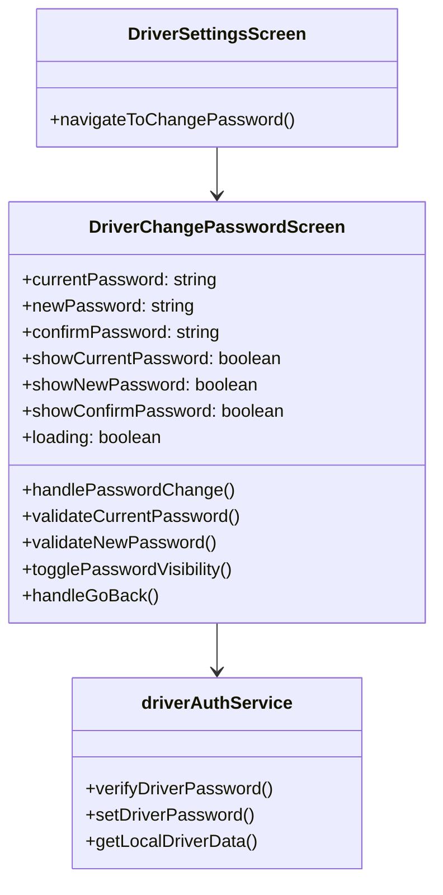
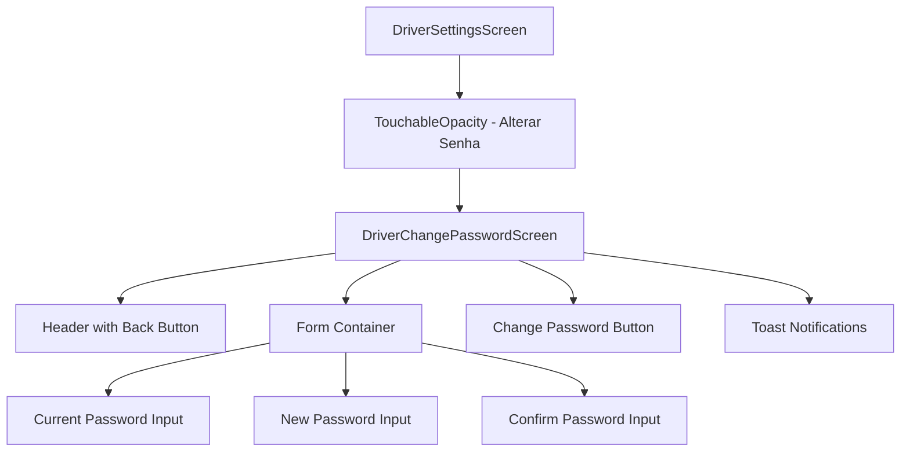
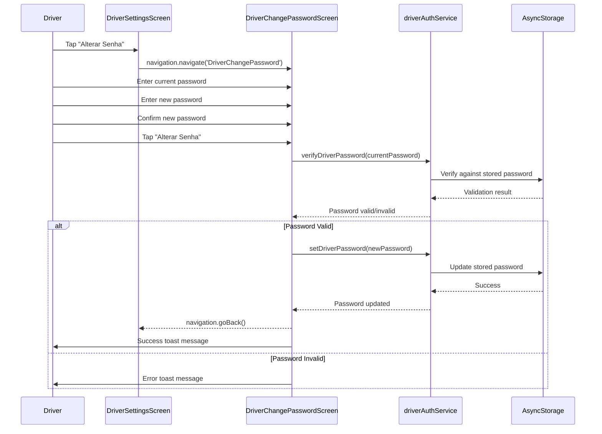
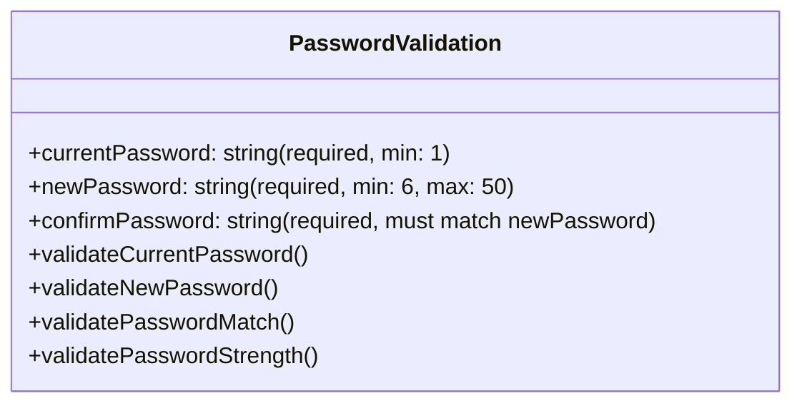

# Driver Password Change Screen Design

## Overview

This document outlines the design for implementing a dedicated password change screen for drivers in the Travel mobile application. The feature allows authenticated drivers to securely update their access passwords through an intuitive interface integrated with the existing driver authentication system.

## Technology Stack & Dependencies

### Frontend Components
- React Native with Expo
- React Navigation (Stack Navigator)
- AsyncStorage for local data persistence
- React Native Vector Icons (Ionicons, MaterialIcons)
- React Native Toast Message for user feedback

### Service Dependencies
- **driverAuthService.js**: Core authentication methods
- **localDatabase.js**: Local data persistence
- **theme.js**: UI styling constants

### Authentication Context
- Existing driver authentication flow
- Local password storage mechanism
- Session management through AsyncStorage

## Component Architecture

### New Component: DriverChangePasswordScreen



### Component Hierarchy



## Screen Flow & Navigation

### Navigation Integration



## Data Models & Validation

### Input Validation Schema



### Validation Rules

| Field | Requirements | Error Messages |
|-------|-------------|----------------|
| Current Password | Required, non-empty | "Digite sua senha atual" |
| New Password | 6+ characters, not same as current | "Nova senha deve ter pelo menos 6 caracteres" |
| Confirm Password | Must match new password | "As senhas não coincidem" |

## User Interface Design

### Layout Structure

```mermaid
graph TD
    A[Screen Container] --> B[Status Bar - Light Content]
    A --> C[Header Section]
    C --> D[Back Button]
    C --> E[Title: "Alterar Senha"]
    A --> F[ScrollView Content]
    F --> G[Current Password Section]
    G --> H[Label + Input with Eye Toggle]
    F --> I[New Password Section]
    I --> J[Label + Input with Eye Toggle]
    F --> K[Confirm Password Section]
    K --> L[Label + Input with Eye Toggle]
    F --> M[Password Requirements Text]
    F --> N[Change Password Button]
    A --> O[Toast Messages]
```

### Visual Design Specifications

| Element | Specification |
|---------|--------------|
| **Header Background** | #1F2937 (Dark Gray) |
| **Content Background** | #F9FAFB (Light Gray) |
| **Input Background** | #FFFFFF (White) |
| **Primary Button** | #2563EB (Blue) |
| **Success Color** | #10B981 (Green) |
| **Error Color** | #EF4444 (Red) |
| **Input Border Radius** | 12px |
| **Button Border Radius** | 12px |

## Business Logic Layer

### Password Change Workflow

```mermaid
flowchart TD
    A[User Input Validation] --> B{All Fields Valid?}
    B -->|No| C[Show Validation Errors]
    B -->|Yes| D[Verify Current Password]
    D --> E{Current Password Correct?}
    E -->|No| F[Show Error: "Senha atual incorreta"]
    E -->|Yes| G[Check New Password != Current]
    G --> H{Passwords Different?}
    H -->|No| I[Show Error: "Nova senha deve ser diferente"]
    H -->|Yes| J[Update Password in Local Storage]
    J --> K{Update Successful?}
    K -->|No| L[Show Error: "Erro ao atualizar senha"]
    K -->|Yes| M[Show Success Message]
    M --> N[Navigate Back to Settings]
```

### Security Considerations

| Security Aspect | Implementation |
|-----------------|----------------|
| **Password Masking** | SecureTextEntry with toggle visibility |
| **Input Validation** | Client-side validation before processing |
| **Local Storage** | Plain text storage (current implementation) |
| **Session Integrity** | Maintain current session after password change |

## API Integration Layer

### Service Method Extensions

```javascript
// driverAuthService.js additions
class DriverAuthService {
  async changeDriverPassword(currentPassword, newPassword) {
    // Verify current password
    const isCurrentValid = await this.verifyDriverPassword(driverId, currentPassword);
    if (!isCurrentValid) {
      throw new Error('Senha atual incorreta');
    }
    
    // Update password
    return await this.setDriverPassword(driverId, newPassword);
  }
}
```

### Error Handling Strategy

```mermaid
graph TD
    A[Password Change Request] --> B{Validation Error?}
    B -->|Yes| C[Display Field-Specific Error]
    B -->|No| D{Authentication Error?}
    D -->|Yes| E[Display "Senha atual incorreta"]
    D -->|No| F{Storage Error?}
    F -->|Yes| G[Display "Erro interno, tente novamente"]
    F -->|No| H[Success - Update UI]
```

## Testing Strategy

### Unit Testing Requirements

| Test Case | Description | Expected Result |
|-----------|-------------|-----------------|
| **Input Validation** | Test all validation rules | Proper error messages |
| **Password Verification** | Test current password check | Correct authentication |
| **Password Update** | Test successful password change | Data persisted correctly |
| **Navigation** | Test back navigation | Proper screen transitions |
| **Error Handling** | Test various error scenarios | Appropriate error messages |

### User Acceptance Criteria

- [ ] Driver can access password change from settings
- [ ] Current password is required and verified
- [ ] New password must meet minimum requirements
- [ ] Password confirmation must match new password
- [ ] Success/error feedback is clear and immediate
- [ ] Navigation back to settings works correctly
- [ ] Password change persists across app sessions

## Implementation Guidelines

### File Structure
```
screens/
  DriverChangePasswordScreen.js (New)
services/
  driverAuthService.js (Updated)
App.js (Updated - add new route)
```

### Development Phases

1. **Phase 1**: Create basic screen structure and navigation
2. **Phase 2**: Implement form validation and user interface
3. **Phase 3**: Integrate with authentication service
4. **Phase 4**: Add error handling and user feedback
5. **Phase 5**: Testing and refinement

### Integration Points

| Component | Integration Method |
|-----------|-------------------|
| **DriverSettingsScreen** | Add navigation to new screen |
| **App.js** | Register new route in Stack Navigator |
| **driverAuthService** | Extend with password change method |
| **Theme Config** | Use existing styling constants |