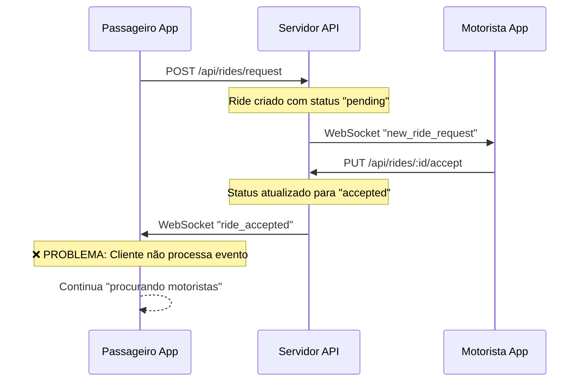
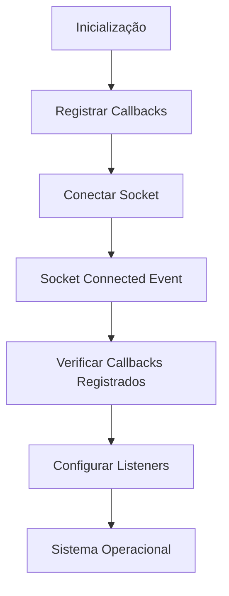
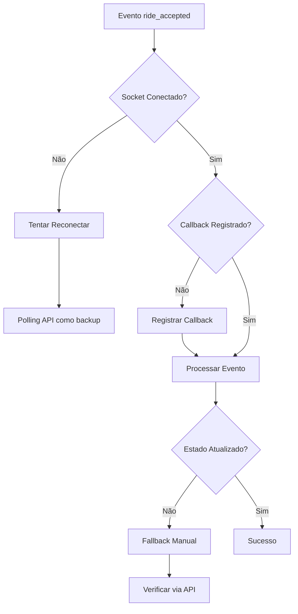

# Análise e Correção - Falta de Feedback após Aceitação de Solicitações

## Problema Identificado

O sistema apresenta um problema crítico onde os passageiros não recebem feedback visual quando um motorista aceita sua solicitação de corrida. O cliente continua na tela de "procurando motoristas" mesmo após a aceitação da solicitação pelo servidor.

## Análise Técnica

### Fluxo de Eventos WebSocket



### Problemas Identificados

#### 1. **Registro de Callbacks WebSocket Inconsistente**
- O sistema registra callbacks para eventos `ride_accepted` no `apiService`
- Porém há problemas na sincronização entre registro de callbacks e conexão do socket

```javascript
// Em HomeScreen.js - Linha 327
apiService.onEvent('ride_accepted', (data) => {
  console.log('🎉 [NOVO USUÁRIO] Corrida aceita pelo motorista:', data);
  
  if (data.test) {
    console.log('🧪 TESTE MANUAL FUNCIONOU!');
    return;
  }
  
  // ❌ PROBLEMA: Lógica de parada de busca está aqui mas pode não executar
  setIsSearchingDrivers(false);
  setDriversFound(true);
  setRequestStatus('accepted');
});
```

#### 2. **Ordem de Execução Problemática**
- Callbacks são registrados ANTES da conexão WebSocket
- Mas o `setupRideEventListeners()` remove listeners anteriores e pode sobrescrevê-los

```javascript
// Em apiService.js - Linha 186
setupRideEventListeners() {
  this.eventCallbacks.forEach((callbacks, eventName) => {
    // ❌ PROBLEMA: Remove todos os listeners existentes
    this.socket.removeAllListeners(eventName);
    
    callbacks.forEach((callback, index) => {
      this.socket.on(eventName, callback);
    });
  });
}
```

#### 3. **Múltiplos Handlers Conflitantes**
- O sistema tem handlers duplicados para o mesmo evento
- Handler interno do `apiService` e handler da aplicação podem interferir

#### 4. **Validação de Conexão Insuficiente**
- O código não verifica adequadamente se o socket está conectado e registrado

### Gaps na Arquitetura

#### 1. **Sistema de Salas WebSocket**
```javascript
// No servidor - Como funciona
socket.join(userType); // 'passenger' ou 'driver'

// Envio direcionado
io.to('passenger').emit('ride_accepted', data);
```

#### 2. **Gestão de Conexões Ativas**
```javascript
// Servidor mantém mapa de conexões
activeConnections.set(socket.id, { userType, userId, socketId });

// Notificação específica vs broadcast
if (!passengerNotified) {
  io.to('passenger').emit('ride_accepted', notificationData);
}
```

## Soluções Propostas

### 1. **Refatoração do Sistema de Callbacks**



#### Implementação:
- Separar claramente registro de callbacks da configuração de listeners
- Garantir que callbacks não sejam sobrescritos
- Implementar validação de registro

### 2. **Sistema de Validação de Estado**

```javascript
// Verificação de estado antes de processar eventos
const validateSocketState = () => {
  return {
    connected: apiService.isConnected,
    registered: !!apiService.userId,
    hasCallbacks: apiService.eventCallbacks.has('ride_accepted'),
    callbackCount: apiService.eventCallbacks.get('ride_accepted')?.length || 0
  };
};
```

### 3. **Logging Estruturado para Debug**

```javascript
// Sistema de debug melhorado
const debugRideAccepted = (data) => {
  console.log('🔍 DEBUG RIDE_ACCEPTED:', {
    timestamp: new Date().toISOString(),
    socketId: apiService.socket?.id,
    eventData: data,
    currentState: {
      isSearching: isSearchingDrivers,
      requestStatus,
      hasDriver: !!driverInfo
    },
    socketState: validateSocketState()
  });
};
```

### 4. **Fallback e Recuperação de Erros**



### 5. **Melhorias no Servidor**

#### Logs Detalhados:
```javascript
// Melhorar logs do servidor
console.log(`📊 Sistema de Notificação - Status:`, {
  rideId: ride.id,
  passengerId: ride.passengerId,
  activeConnections: activeConnections.size,
  passengerSocketFound: passengerNotified,
  broadcastMethod: passengerNotified ? 'specific' : 'broadcast'
});
```

#### Confirmação de Entrega:
```javascript
// Implementar ACK para eventos críticos
socket.emit('ride_accepted', data, (ack) => {
  if (ack) {
    console.log('✅ Cliente confirmou recebimento');
  } else {
    console.warn('⚠️ Cliente não confirmou - usar fallback');
  }
});
```

## Passos de Implementação

### Fase 1: Diagnóstico
1. Adicionar logging detalhado em pontos críticos
2. Verificar estado de conexões WebSocket
3. Validar registro de callbacks

### Fase 2: Correções Imediatas
1. Garantir ordem correta de registro vs conexão
2. Evitar remoção de callbacks já registrados
3. Implementar validação de estado

### Fase 3: Melhorias de Robustez
1. Sistema de fallback via polling
2. Confirmação de entrega de eventos
3. Recuperação automática de erros

### Fase 4: Monitoramento
1. Dashboard de saúde do WebSocket
2. Métricas de entrega de eventos
3. Alertas para falhas de comunicação

## Testes de Validação

### 1. **Teste de Conectividade**
```javascript
// Verificar se socket está funcionando
apiService.socket.emit('ping', { test: true });
```

### 2. **Teste de Callbacks**
```javascript
// Simular evento manualmente
apiService.triggerCallbacks('ride_accepted', testData);
```

### 3. **Teste End-to-End**
```javascript
// Ciclo completo: request → accept → notification
const testFullCycle = async () => {
  // 1. Criar solicitação
  // 2. Aceitar via API direta
  // 3. Verificar se cliente recebe evento
};
```

## Métricas de Sucesso

- **99%** de eventos `ride_accepted` entregues com sucesso
- **< 2 segundos** de tempo para feedback ao passageiro
- **Zero** casos de passageiros "presos" na tela de busca
- **Logs claros** para debugging de problemas

## Considerações de Performance

- Callbacks leves para evitar bloqueio
- Timeouts para evitar callbacks infinitos
- Cleanup adequado de listeners
- Reconnection handling otimizado

## Riscos e Mitigações

| Risco | Impacto | Mitigação |
|-------|---------|-----------|
| Callbacks duplicados | Performance degradada | Validação antes de registro |
| Socket desconectado | Perda de eventos | Auto-reconnect + fallback |
| Estado inconsistente | UX ruim | Validação de estado |
| Servidor sobrecarregado | Timeouts | Load balancing |