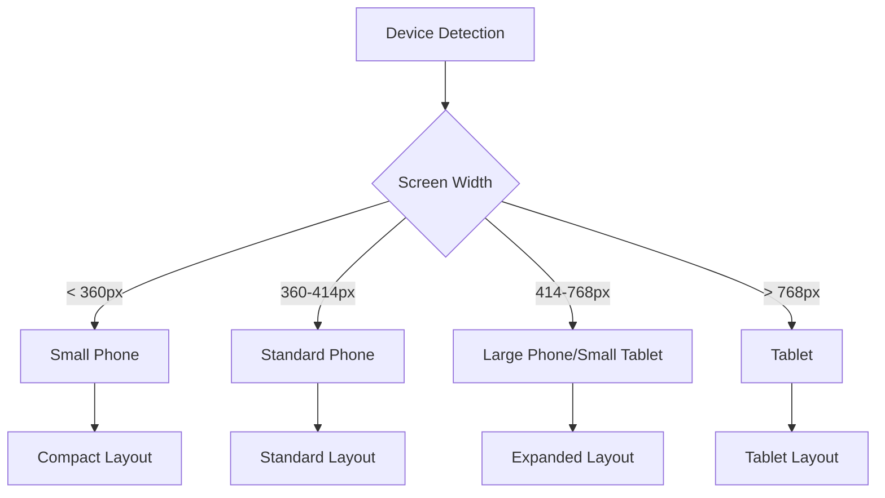
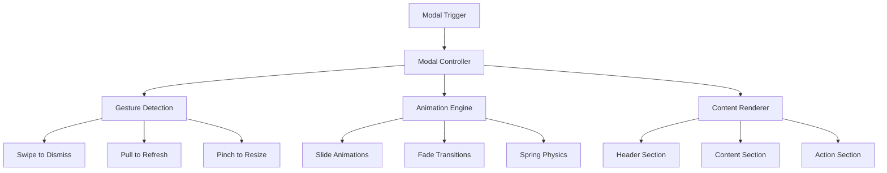
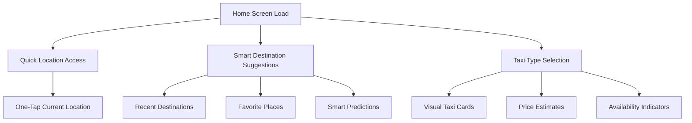
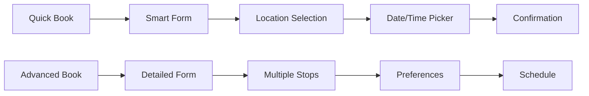
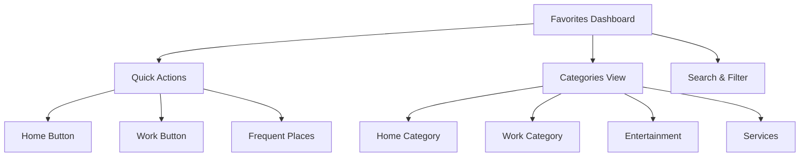
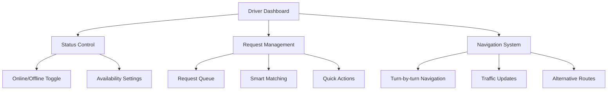
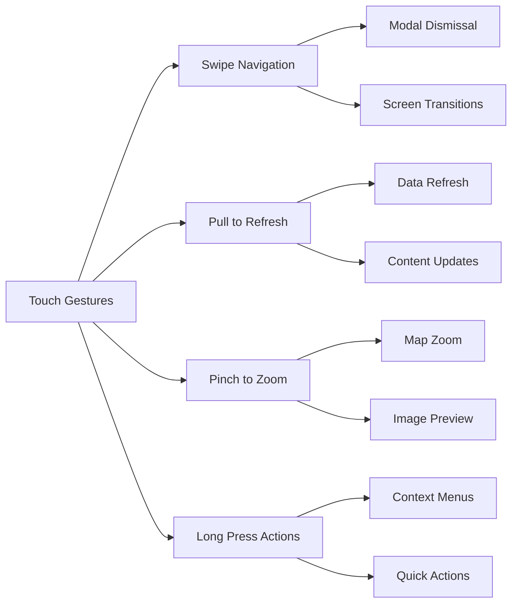
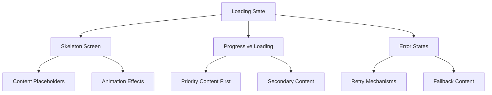
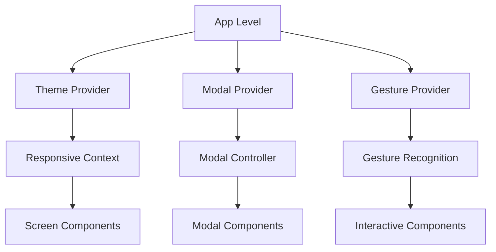

# Responsive UX Improvement Design

## Overview

This design document outlines comprehensive improvements to enhance responsiveness and user experience across all devices for the Travel mobile application. The focus is on creating a more intuitive, beautiful, and accessible interface with improved modals, particularly for key screens including Home, Reservas (Bookings), Favoritos (Favorites), and Driver MapScreen.

## Technology Stack & Dependencies

**Frontend Framework:**
- React Native 0.79.5 with Expo SDK 53.0.22
- React Navigation v7 (Stack and Bottom Tabs)
- Theme system with centralized styling

**UI/UX Libraries:**
- react-native-vector-icons (MaterialIcons, Ionicons)
- react-native-toast-message for notifications
- react-native-reanimated for smooth animations
- react-native-gesture-handler for enhanced touch interactions
- react-native-safe-area-context for device adaptation

## Responsive Design System

### Breakpoint Strategy



### Adaptive Component Sizing

| Component Type | Small (<360px) | Standard (360-414px) | Large (414-768px) | Tablet (>768px) |
|---|---|---|---|---|
| Modal Height | 75% screen | 80% screen | 70% screen | 60% screen |
| Button Height | 48px | 55px | 60px | 65px |
| Text Input Height | 48px | 55px | 60px | 65px |
| Card Padding | 12px | 15px | 20px | 25px |
| Icon Size | 20px | 24px | 28px | 32px |

### Enhanced Theme System

```typescript
// Responsive theme extensions
export const RESPONSIVE = {
  getScreenSize: () => {
    const { width } = Dimensions.get('window');
    if (width < 360) return 'small';
    if (width < 414) return 'standard';
    if (width < 768) return 'large';
    return 'tablet';
  },
  
  getDynamicSize: (sizes) => {
    const screenSize = RESPONSIVE.getScreenSize();
    return sizes[screenSize] || sizes.standard;
  },
  
  getDynamicSpacing: (base) => {
    const multiplier = RESPONSIVE.getScreenSize() === 'small' ? 0.8 : 
                     RESPONSIVE.getScreenSize() === 'tablet' ? 1.2 : 1;
    return base * multiplier;
  }
};
```

## Modal System Redesign

### Unified Modal Architecture



### Enhanced Modal Components

**BaseModal Component:**
- Adaptive height based on content and screen size
- Gesture-based interactions (swipe to dismiss, pull indicators)
- Keyboard-aware positioning
- Accessibility support with proper focus management
- Consistent animation patterns

**Modal Variants:**
1. **BottomSheet Modal** - For forms and selections
2. **Fullscreen Modal** - For complex interactions
3. **Overlay Modal** - For confirmations and alerts
4. **Slide Modal** - For step-by-step processes

## Screen-Specific UX Improvements

### HomeScreen Enhancements

**Current Issues:**
- Complex nested state management
- Large file size (4,219 lines) affecting performance
- Inconsistent modal behavior
- Poor keyboard handling

**UX Improvements:**



**Modal Improvements:**
- **Destination Search Modal**: Floating card design with smooth animations
- **Taxi Selection Modal**: Horizontal carousel with visual previews
- **Trip Confirmation Modal**: Clear pricing, route preview, and ETA
- **Driver Search Modal**: Live updates with pulse animations

### ReservasScreen (Bookings) Improvements

**Current Issues:**
- Multi-step form complexity
- Poor date/time picker integration
- Inconsistent validation feedback

**Enhanced User Flow:**



**UX Enhancements:**
- **Progressive Form Design**: One field at a time with smooth transitions
- **Smart Auto-complete**: Context-aware suggestions
- **Visual Date/Time Picker**: Calendar integration with availability
- **Real-time Validation**: Immediate feedback with helpful suggestions

### FavoritosScreen (Favorites) Improvements

**Current Issues:**
- Static list presentation
- Limited categorization
- Poor search functionality

**Enhanced Design:**



**UX Improvements:**
- **Smart Categories**: Auto-categorization with visual icons
- **Quick Action Cards**: One-tap navigation to frequent destinations
- **Visual Search**: Map integration for location-based search
- **Usage Analytics**: Frequency-based recommendations

### DriverMapScreen Enhancements

**Current Issues:**
- Complex real-time state management
- Poor request modal design
- Limited navigation feedback

**Enhanced Driver Experience:**



**Modal Improvements:**
- **Request Modal**: Card-based design with passenger info, route preview, and estimated earnings
- **Navigation Modal**: Persistent bottom sheet with clear directions
- **Status Modal**: Quick toggles for availability and preferences

## Accessibility & Usability Enhancements

### Accessibility Features

| Feature | Implementation | Benefit |
|---|---|---|
| Screen Reader Support | Semantic labeling, reading order | Visually impaired users |
| High Contrast Mode | Dynamic color adjustments | Low vision users |
| Large Text Support | Scalable font system | Reading difficulties |
| Voice Commands | Speech recognition integration | Motor impairments |
| Haptic Feedback | Contextual vibrations | Audio/visual impairments |

### Gesture-Based Interactions



## Performance Optimizations

### Rendering Performance

**Lazy Loading Strategy:**
- Modal content loaded on demand
- Image lazy loading with progressive enhancement
- Component-level code splitting

**Animation Optimizations:**
- Hardware-accelerated animations using native driver
- Reduced animation complexity for low-end devices
- Frame rate adaptive animations

**Memory Management:**
- Component recycling for lists
- Image caching with automatic cleanup
- State cleanup on screen unmount

### Loading States & Skeleton Screens



## Design Language Evolution

### Visual Hierarchy

**Enhanced Card System:**
- Elevated cards with consistent shadows
- Color-coded categories
- Dynamic content adaptation
- Micro-interactions on touch

**Typography Scale:**
- Responsive font sizing
- Improved readability contrast ratios
- Language-specific font optimizations (Portuguese)
- Dynamic type support

### Color System Enhancement

```typescript
export const ENHANCED_COLORS = {
  primary: {
    50: '#eff6ff',
    100: '#dbeafe',
    500: '#2563eb', // Main brand color
    600: '#1d4ed8',
    900: '#1e3a8a'
  },
  semantic: {
    success: '#10b981',
    warning: '#f59e0b',
    error: '#ef4444',
    info: '#3b82f6'
  },
  surface: {
    background: '#ffffff',
    card: '#ffffff',
    overlay: 'rgba(0, 0, 0, 0.5)',
    modal: '#ffffff'
  }
};
```

## Implementation Architecture

### Component Structure



### State Management Strategy

**Modal State Management:**
- Global modal state with React Context
- Screen-specific modal configurations
- Gesture state synchronization
- Animation state coordination

**Responsive State:**
- Device orientation handling
- Screen size change detection
- Dynamic layout recalculation
- Performance monitoring

### Testing Strategy

**Visual Regression Testing:**
- Screenshot comparison across devices
- Modal interaction testing
- Animation performance testing
- Accessibility compliance testing

**User Experience Testing:**
- Touch target size validation
- Gesture recognition accuracy
- Loading time optimization
- Error state handling

## Migration Strategy

### Phase 1: Foundation (Week 1-2)
- Implement responsive theme system
- Create base modal components
- Establish gesture recognition framework

### Phase 2: Core Screens (Week 3-4)
- Enhance HomeScreen modals
- Improve ReservasScreen user flow
- Redesign FavoritosScreen interface

### Phase 3: Advanced Features (Week 5-6)
- Implement DriverMapScreen improvements
- Add accessibility features
- Performance optimizations

### Phase 4: Polish & Testing (Week 7-8)
- Visual design refinements
- Comprehensive testing
- User feedback integration

This design provides a comprehensive framework for creating a more responsive, intuitive, and beautiful user experience across all devices while maintaining the app's core functionality and regional requirements for Angola.