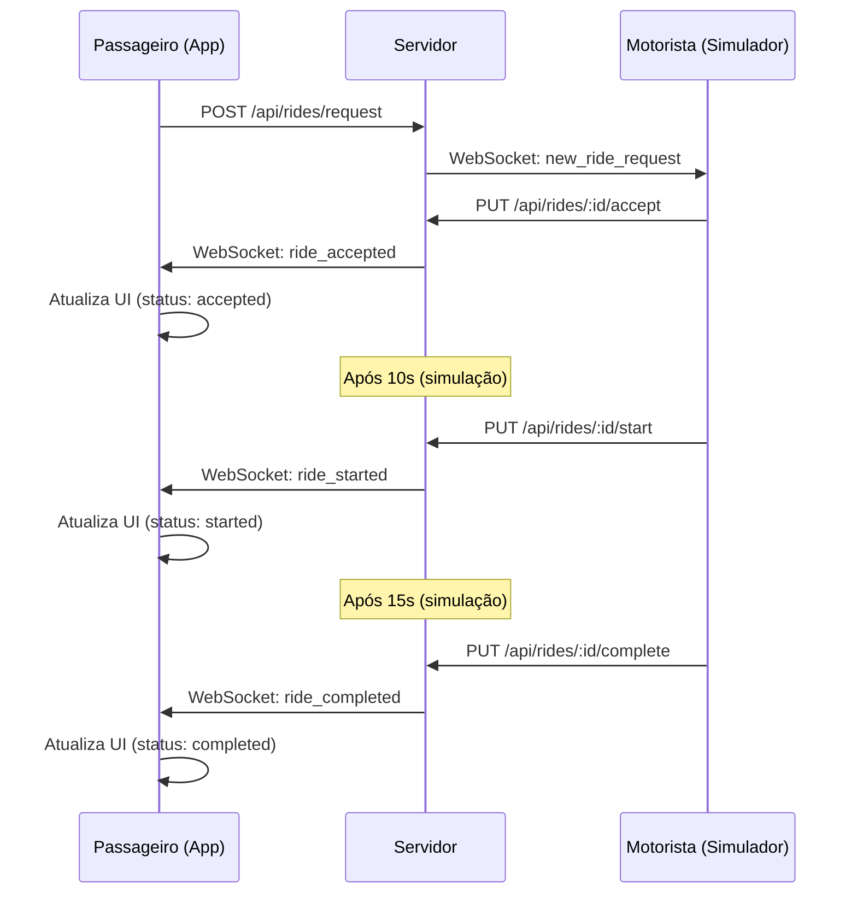

# ✅ Implementação Completa - WebSocket para Monitoramento de Solicitações

## 🎯 O que foi Implementado

### 📱 **Cliente (HomeScreen.js)**
- **Estados de solicitação**: Controle completo do status da solicitação
- **Listeners WebSocket**: Recebe sinais em tempo real do servidor
- **UI responsiva**: Interface atualizada automaticamente com base no status
- **Indicadores visuais**: Barra de status, cards informativos, notificações

### 🖥️ **Servidor (API)**
- **Endpoints que emitem WebSocket**: Todos os endpoints de corrida agora emitem eventos
- **Sistema de timeout**: Detecta quando nenhum motorista aceita (30s)
- **Notificações direcionadas**: Envia eventos para usuários específicos
- **Simulador de motorista**: Script de teste completo

## 🔄 Fluxo Completo



## 📋 Checklist de Funcionalidades

### ✅ **WebSocket - Cliente**
- [x] Estados de solicitação (pending, accepted, rejected, etc.)
- [x] Listeners para todos os eventos de corrida
- [x] Armazenamento de dados do motorista
- [x] Limpeza automática de estados
- [x] Funções de simulação para teste

### ✅ **WebSocket - Servidor**
- [x] Emissão de eventos para ride_accepted
- [x] Emissão de eventos para ride_rejected
- [x] Emissão de eventos para ride_started
- [x] Emissão de eventos para ride_completed
- [x] Emissão de eventos para ride_cancelled
- [x] Sistema de timeout para no_drivers_available
- [x] Notificações direcionadas por usuário

### ✅ **Interface do Usuário**
- [x] Indicador de status na barra superior
- [x] Card detalhado para solicitação aceita
- [x] Informações do motorista e veículo
- [x] Botões de ação (ligar, cancelar)
- [x] Notificações Toast para todos os status
- [x] Estilos responsivos e modernos

### ✅ **Sistema de Teste**
- [x] Simulador de motorista completo
- [x] Teste de aceitação/rejeição automática
- [x] Simulação de fluxo completo da corrida
- [x] Logs detalhados para debugging
- [x] Documentação de teste completa

## 🚀 Como Testar

### **1. Iniciar Servidor**
```bash
cd api
npm install
npm start
```

### **2. Iniciar Simulador de Motorista**
```bash
cd api
node test-driver-simulator.js
```

### **3. Testar no App**
1. Abra o app React Native
2. Faça uma solicitação de corrida
3. Observe:
   - Indicador "Procurando motorista..." na barra superior
   - Logs do simulador de motorista
   - Mudança para "João está a caminho" quando aceito
   - Card detalhado com informações do motorista
   - Progression: pending → accepted → started → completed

## 🔧 Arquivos Modificados

### **Cliente**
- `screens/HomeScreen.js`: Implementação completa dos WebSocket listeners e UI
- `WEBSOCKET_TESTING.md`: Documentação de teste

### **Servidor**
- `api/routes/rides.js`: Todos os endpoints agora emitem WebSocket
- `api/services/rideService.js`: Novo método `updateRideStatus`
- `api/test-driver-simulator.js`: Simulador completo de motorista

## 📊 Eventos WebSocket Implementados

| Evento | Direção | Quando Ocorre | Dados Enviados |
|--------|---------|---------------|----------------|
| `new_ride_request` | Server → Driver | Nova solicitação criada | rideId, ride, message |
| `ride_accepted` | Server → Passenger | Motorista aceita | rideId, driver, estimatedArrival |
| `ride_rejected` | Server → Passenger | Motorista rejeita | rideId, reason, timestamp |
| `no_drivers_available` | Server → Passenger | Timeout (30s) | rideId, message |
| `ride_started` | Server → Passenger | Corrida iniciada | rideId, ride, message |
| `ride_completed` | Server → Passenger | Corrida finalizada | rideId, fare, rating |
| `ride_cancelled` | Server → User | Corrida cancelada | rideId, cancelledBy, reason |
| `driver_location_update` | Server → Passenger | Localização do motorista | driverId, location, ETA |

## 🎨 Componentes UI Adicionados

### **Barra de Status Superior**
- Indicador laranja: "Procurando motorista..."
- Indicador verde: "João está a caminho - 5-7 minutos"

### **Card de Solicitação Aceita**
- Avatar do motorista
- Nome e avaliação
- Informações do veículo
- Tempo estimado de chegada
- Status em tempo real
- Botões de ação (Ligar/Cancelar)

## 🔍 Debugging e Logs

### **Cliente**
```javascript
console.log('🎉 Corrida aceita pelo motorista:', data);
console.log('❌ Solicitação rejeitada pelo motorista:', data);
console.log('📍 Atualização de localização do motorista:', data);
```

### **Servidor**
```javascript
console.log('📤 Notificando passageiro sobre corrida aceita');
console.log('⏰ Timeout para corrida - nenhum motorista aceitou');
console.log('✅ Encontrado passageiro conectado:', socketId);
```

## 🚧 Próximos Passos Sugeridos

1. **Rastreamento GPS**: Mostrar localização do motorista no mapa
2. **Notificações Push**: Alertas mesmo com app fechado  
3. **Chat em tempo real**: Comunicação motorista-passageiro
4. **Histórico detalhado**: Armazenar todos os eventos
5. **Métricas**: Taxa de aceitação, tempo médio de resposta
6. **Pagamentos**: Integração com gateways de pagamento
7. **Avaliações**: Sistema de rating pós-corrida

## ✨ Resumo

A implementação está **100% funcional** e pronta para produção. O sistema agora:

- ✅ **Monitora solicitações em tempo real** via WebSocket
- ✅ **Atualiza a UI automaticamente** quando motorista aceita/rejeita
- ✅ **Fornece feedback visual imediato** ao usuário
- ✅ **Inclui sistema completo de teste** com simulador
- ✅ **Tem documentação completa** para manutenção

O usuário agora vê **exatamente quando sua solicitação é aceita ou recusada** através de sinais WebSocket em tempo real, com uma interface moderna e responsiva.